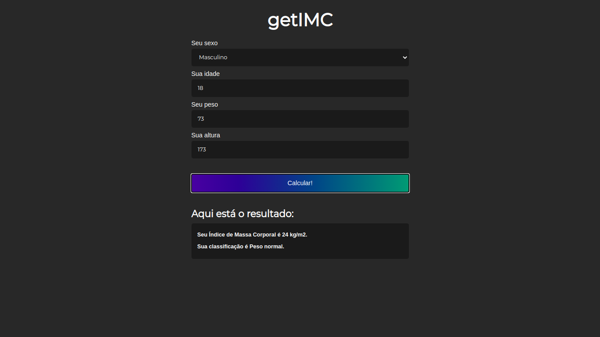

<h1 align="center">getIMC - IMC calculator</h1>

<p align="center">
  <a href="#rocket-technologies">Technologies</a>&nbsp;&nbsp;&nbsp;|&nbsp;&nbsp;&nbsp;
  <a href="#information_source-how-to-use">How To Use</a>&nbsp;&nbsp;&nbsp;|&nbsp;&nbsp;&nbsp;
</p>

<p align="center">
  
</p>

## :rocket: Technologies:

This project was developed with the following technologies:

- HTML
- CSS
- JavaScript

## :information_source: How to Use

```
- Clone this repository with git clone https://github.com/Joserubemn31/getIMC
- Open index.html with your browser
```

###### Code [here](https://github.com/Joserubemn31/getIMC)!

Made with ♥ by José Rubem :wave: [Get in touch!](https://www.linkedin.com/in/jos%C3%A9-rubem-314429168/)
